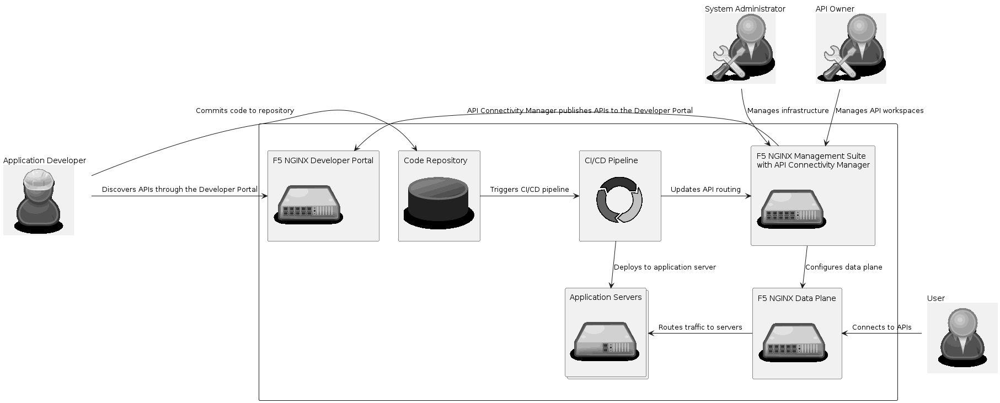

# Deploying API Changes to F5 NGINX Management Suite 

## Solution Description


In this solution a developer's changes to an API specified by an OpenAPI document are deployed to F5 NGINX Management Suite.
Using this solution in a CI/CD pipeline provides a way to automate API discovery, registration, and security as API changes are made.

## Value
API changes are published to a central location as they are made to improve API discovery.

## Automation to Deploy Solution
Automation is done using Ansible.
Running the `deploy.yml` playbook with the appropriate environment variables will deploy the OpenAPI document to F5 NGINX Management Suite.

### Environment Variables
* NMS_WORKSPACE: The service workspace that API changes should be published to.
* NMS_USER: Username of the Management Suite account that will be making the updates.
* NMS_PASSWORD: Password of the Management Suite account that will be making the updates.
* NMS_API_HOST: Hostname of NGINX Data Plane host.
* NMS_DEV_HOST: Hostname of the NGINX Developer Portal host.

## Deep Dive
This section goes through the `deploy.yaml` Ansible Playbook in additional detail.
The playbook is making use of the `ansible.builtin.url` module to make calls to the F5 NGINX API Connectivity Manager REST API.

### Updating the API Document
```yaml
  - name: Check API Document
    ansible.builtin.uri:
      url: "{{ workspace }}/api-docs/{{ api_doc_name}}"
      user: "{{ lookup('ansible.builtin.env', 'NMS_USER') }}"
      password: "{{ lookup('ansible.builtin.env', 'NMS_PASSWORD') }}"
      method: get
      status_code: [200, 404]
    register: doc_result
```
First we need to check if the API document already exists.

```yaml
  - name: Create API Document
    when: doc_result.json._links | length == 0
    ansible.builtin.uri:
      url: "{{ workspace }}/api-docs"
      user: "{{ lookup('ansible.builtin.env', 'NMS_USER') }}"
      password: "{{ lookup('ansible.builtin.env', 'NMS_PASSWORD') }}"
      method: post
      body_format: json
      body: "{{ openapi_file | from_yaml | to_json }}"
      status_code: [201]
    changed_when: true
```
If the API document does not exist, we create it with a `POST` request.

```yaml
  - name: Update API Document
    when: doc_result.json._links | length > 0
    ansible.builtin.uri:
      url: "{{ workspace }}/api-docs"
      user: "{{ lookup('ansible.builtin.env', 'NMS_USER') }}"
      password: "{{ lookup('ansible.builtin.env', 'NMS_PASSWORD') }}"
      method: post
      body_format: json
      body: "{{ openapi_file | from_yaml | to_json }}"
      status_code: [200]
    changed_when: true
```
If the API document already exists, then we would get a 409 status code response with a `POST` request.
Instead we can use a `PUT` request to update the proxy configuration.

### Updating the Proxies
```yaml
  vars:
    proxy_name: petstore-api
    openapi_path: src/main/resources/openapi.yaml
    openapi_file: "{{ lookup('ansible.builtin.file', openapi_path) }}"
    api_title: "{{ (openapi_file | from_yaml).info.title | lower | regex_replace('\\s', '-') }}"
    api_version: "{{ (openapi_file| from_yaml).info.version | regex_replace('\\.', '-') }}"
    api_doc_name: "{{ api_title }}-{{ api_version }}"
    proxy_config:
      name: "{{ proxy_name }}"
      version: v1
      specRef: "{{ api_doc_name }}"
      proxyConfig:
        hostname: 10.145.74.5
        ingress:
          basePath: "/v1"
        backends:
        - serviceName: "{{ proxy_name }}-svc"
          serviceTargets: []
      portalConfig:
        hostname: 10.145.77.104
```
At the beginning of the playbook we create the proxy configuration and store it in a variable.
This makes it easier for us to reuse this data for different HTTP requests without duplicating it in the playbook.
When the API document is uploaded, it is given a generated name.
Fortunately, that name is deterministic, so we can predict what it will be in order to provide it in the proxy configuration in the `specRef` property.

```yaml
  - name: Check Proxy
    ansible.builtin.uri:
      url: "{{ workspace }}/proxies/{{ proxy_name }}"
      user: "{{ lookup('ansible.builtin.env', 'NMS_USER') }}"
      password: "{{ lookup('ansible.builtin.env', 'NMS_PASSWORD') }}"
      method: get
    register: proxy_result
```
First we need to check if the proxy already exists.

```yaml
  - name: Create proxy
    when: proxy_result.json._links | length == 0
    ansible.builtin.uri:
      url: "{{ workspace }}/proxies"
      user: "{{ lookup('ansible.builtin.env', 'NMS_USER') }}"
      password: "{{ lookup('ansible.builtin.env', 'NMS_PASSWORD') }}"
      method: post
      body_format: json
      body: "{{ proxy_config | to_json }}"
      status_code: [202]
    changed_when: true
```
If the proxy configuration does not exist, we create it with a `POST` request.

```yaml
  - name: Update proxy
    when: proxy_result.json._links | length > 0
    ansible.builtin.uri:
      url: "{{ workspace }}/proxies//{{ proxy_name }}"
      user: "{{ lookup('ansible.builtin.env', 'NMS_USER') }}"
      password: "{{ lookup('ansible.builtin.env', 'NMS_PASSWORD') }}"
      method: put
      body_format: json
      body: "{{ proxy_config | to_json }}"
      status_code: [202]
    changed_when: true
```
If the proxy already exists, then we would get a 409 status code response with a `POST` request.
Instead we can use a `PUT` request to update the proxy configuration.
